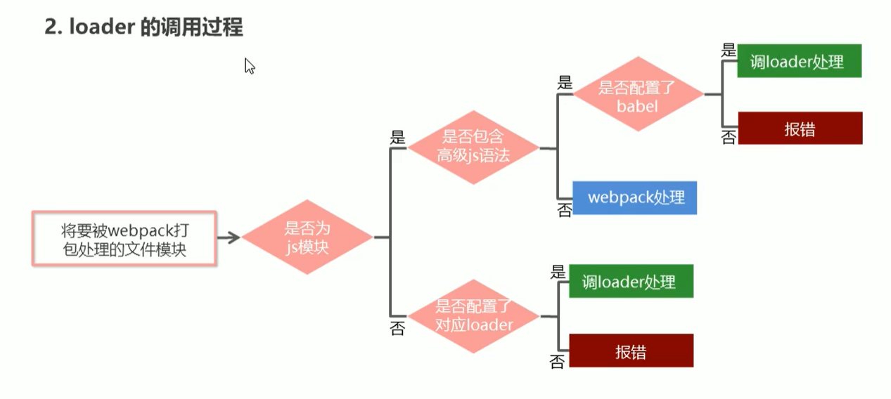

# webpack

## 1. 创建列表隔行变色项目

1. 新建项目空白目录，并运行 `npm init -y` 命令，初始化包管理配置文件 `package.json`
2. 新建 `src` 源代码目录
3. 新建 src -> `index.html` 首页
4. 初始化首页基本的结构
5. 运行 `npm install jquery -S` 命令，安装 jQuery
6. 通过模块化的形式，实现列表隔行变色效果
    完成上述步骤发现并不能运行成功，这是因为 `index.js` 中 `import $ from 'jquery'` 是 ES6 的模块化语法，浏览器暂时不支持，所以需要基于 webpack 将有兼容性的 js 代码转换为没有兼容性的代码，继续后续步骤
7. 运行 `npm install webpack webpack-cli -D` 命令，安装 webpack 相关的包
8. 在项目根目录中，创建名为 `webpack.config.js` 的 webpack 配置文件
9. 在 webpack 的配置文件中，初始化如下基本配置：

    ```js
    module.exports = {
      mode: 'development', // mode 用来指定构建模式
    }
    ```

    > mode 有两种值：development 和 production
    >
    > 前者表示开发模式，转换出来的代码不会进行压缩与混淆，转换速度快
    >
    > 后者表示生产模式，转换出来的代码会进行压缩与混淆，转换时间长（一般用于项目上线的时候）

10. 在·`package.json` 配置文件中的 `scripts` 节点下， 新增·`dev` 脚本如下：

    ```js
    "scripts": {
      "dev" :"webpack" // script 节点下的脚本， 可以通过 npm run dev 执行
    }
    ```

11. 在终端中运行 `npm run dev` 命令， 启动 webpack 进行项目打包。

## 2. webpack的基本使用

### 配置打包的入口与出口

在webpack.config.js文件中配置：

```js
const path = require('path')

module.exports = {
  // 编译模式
  mode: "development",
  entry: path.join(__dirname, './src/index.js'), // 打包入口文件的路径
  output: {
    path: path.join(__dirname, './dist'), // 输出文件的存放路径
    filename: 'bundle.js' // 输出文件的名称
  }
}
```

### 配置webpack的自动打包功能

1. 运行`npm install webpack-dev-server -D`命令，安装支持项目自动打包的工具
2. 修改 package.json -> scripts 中的dev命令如下：

    ```js
    "scripts":{
      "dev": "webpack-dev-server" // script节点下的脚本，可以通过 npm run 执行
    }
    ```

3. 将 src -> index.html 这，script 脚本的引用路径，修改为"/ bundle.js"
4. 运行 `npm run dev` 命令，重新进行打包
5. 在浏览器中访问 `http://loaclhost:8080` 地址，查看自动打包效果

注意：

- webpack-dev-server 会启动一个实时打包的http服务器
- webpack-dev-server 打包生成的输出文件，默认放到了项目根目录中，而且是虚拟的、看不见的

### 配置 html-webpack-plugin 生成预览界面

1. 运行 `npm install html-webpack-plugin -D` 命令，安装生成预览页面的插件
2. 修改 webpack.config.js 文件头部区域，添加如下配置信息：

    ```js
    // 导入生成预览页面的插件，得到一个构造函数
    const HtmlWebpackPlugin = require('html-webpack-plugin')
    const htmlPlugin = new HtmlWebpackPlugin({ //创建插件的实例对象
      template: './src/index.html', // 指定要用到的模板文件
      filename: 'index.html' // 指定生成的文件名称，该文件存于内存中，在目录中不显示
    })
    ```

3. 修改 webpack.config.js 文件中向外暴露的配置对象，新增如下配置节点：

    ```js
    module.exports = {
      plugins: [ htmlPlugin ] // plugins数组是 webpack 打包期间会用到的一些插件列表
    }
    ```

### 配置自动打包相关的参数

```js
// package.json 中的配置
// --open 打包完成后自动打开浏览器页面
// --host 配置 IP 地址
// --port 配置端口
"scripts": {
  "dev": "webpack-dev-server --open --host 127.0.0.1 --port 8888"
},
```

## 3. webpack 中的加载器

### 通过loader打包非js模块

在实际开发过程中，webpack默认只能打包处理以 .js 后缀名结尾的模块，其他非 .js 后缀名结尾的模块，webpack默认处理不了，需要调用loader加载器才可以正常打包，否则会报错！

loader加载器可以协助webpack打包处理特定的文件模块，比如：

- less-loader 可以打包处理 .less 相关的文件
- sass-loader 可以打包处理 .sass 相关的文件
- url-loader 可以打包处理 css 中与 url 路径相关的文件

### loader 的调用过程



### webpack中加载器的基本使用

- css
- LESS
- SCSS
- PostCss
- JavaScript
- Image/Font
- Vue

#### 打包处理css文件

1. 运行 `npm i style-loader css loader -D` 命令，安装处理css文件的loader
2. 在`webpack.config.js` 的 `module` -> `rules` 数组中，添加 loader 规则如下：

    ```js
    // 所有第三方文件模块的匹配规则
    module: {
      rules: [
        { test: /\.css$/, use: ['style-loader', 'css-loader'] }
      ]
    }
    ```

    其中，test表示匹配的文件类型 ，use表示对应要调用的loader
    注意：
    - use数组中指定的 loader顺序是固定的
    - 多个loader的调用顺序是：从后往前调用

#### 打包处理lcss文件

1. 运行 `npm i less-loader less -D` 命令
2. 在`webpack.config.js` 的 `module` -> `rules` 数组中，添加 loader 规则如下：

    ```js
    // 所有第三方文件模块的匹配规则
    module: {
      rules: [
        { test: /\.less$/, use: ['style-loader', 'css-loader', 'less-loader'] }
      ]
    }
    ```

#### 打包处理scss文件

1. 运行 `npm i sass-loader node-sass -D` 命令，安装处理css文件的loader
2. 在`webpack.config.js` 的 `module` -> `rules` 数组中，添加 loader 规则如下

    ```js
    // 所有第三方文件模块的匹配规则
    module: {
      rules: [
        { test: /\.scss$/, use: ['style-loader', 'css-loader', 'sass-loader'] }
      ]
    }
    ```

##### 安装node-sass可能会出现问题

```js
Downloading binary from https://github.com/sass/node-sass/releases/download/v4.14.1/win32-x64-72_binding.node
Cannot download "https://github.com/sass/node-sass/releases/download/v4.14.1/win32-x64-72_binding.node":

ESOCKETTIMEDOUT

Hint: If github.com is not accessible in your location
      try setting a proxy via HTTP_PROXY, e.g.

      export HTTP_PROXY=http://example.com:1234

or configure npm proxy via

      npm config set proxy http://example.com:8080
```

原因是由于网络限制导致无法下载 .node 文件，解决方法如下：

使用淘宝镜像，使用镜像前请把node_modules文件夹下原有的node-sass有关的文件全删了

```js
npm set sass_binary_site = http://npm.taobao.org/mirrors/node-sass/

npm install -g cnpm --registry = http://registry.npm.taobao.org

cnpm install node-sass
```

##### 第三步运行可能会碰到如下问题

```js
cnpm : 无法加载文件 D:\Softwares\nodejs\node_global\cnpm.ps1，因为在此系统上禁止运行脚本。有关详细信息，请参阅 https:/go.microsoft.com/fwlink/?LinkID=135170 中的 about_Execution_Po
licies。
所在位置 行:1 字符: 1
+ cnpm install node-sass
+ ~~~~
    + CategoryInfo          : SecurityError: (:) []，PSSecurityException
    + FullyQualifiedErrorId : UnauthorizedAccess
```

这是说是没有权限，需要用管理员身份进行运行并授权
解决方法：

打开本地的 Windows PowerShell，以管理员身份运行：

```js
set-ExecutionPolicy RemoteSigned

再输入 Y 即可
```

#### 配置 postCSS 自动添加 css 的兼容前缀

1. 运行 `npm i postcss-loader autoprefixer -D` 命令
2. 在项目根目录中创建 postcss 的配置文件 postcss.config.js，并初始化如下配置：

    ```js
    const autoprefixer = require('autoprefixer') // 导入自动添加前缀的插件
    module.exports = {
      plugins: [ autoprefixer ] // 挂载插件
    }
    ```

3. 在 `webpack.config.js` 的 `module -> rules` 数组中，修改 css 的loader规则如下：

    ```js
    module: {
      rules: [
        { test: /\.css/, use: ['style-loader', 'css-loader', 'postcss-loader'] }
      ]
    }
    ```

#### 打包样式表中的图片和字体文件

1. 运行 `npm i url-loader file-loader -D` 命令
2. 在 `webpack.config.js`·的 `module -> rules` 数组中，添加loader规则如下：

    ```js
    module: {
      rules: [
        { test: /\.jpg|png|gif|ttf|eot|svg|woff|woff2$/,
        use: 'url-loader?limit=16940'}
      ]
    }
    ```

    其中 ? 之后是 loader 的参数项
    limit 用来指定图片的大小，单位是字节(byte)，只有小于limit大小的图片，才会被转为base64图片

#### 打包处理js文件中的高级语法

1. 安装babel转换器相关的包： `npm i babel-loader @babel/core @babel/runtime -D`
2. 安装babel语法插件相关的包： `npm i @babel/preset-env @babel/plugin-transform-runtime @babel/plugin-proposal-class-properties -D`
3. 在项目根目录中，创建babel配置文件`babel.config.js`并初始化基本配置如下：

    ```js
    module.exports = {
      presets: ['@babel/preset-env'],
      plugins: ['@babel/plugin-transform-runtime', '@babel/plugin-proposal-class-properties']
    }
    ```

4. 在 `webpack.config.js`的module -> rules 数组中，添加loader规则如下：

```js
// exclude为排除项，表示babel-loader不需要处理node_modules中的js文件
{test: /\.js$/, use: 'babel-loader', exclude: /node_modules/}
```
